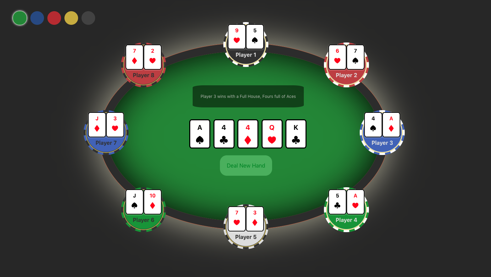
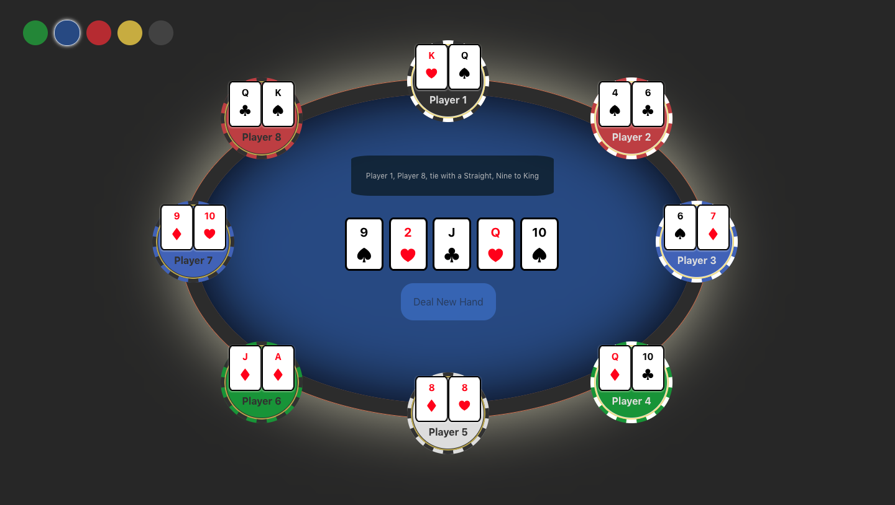

# React Texas Hold'em Table

---

### Overview

React application that allows a user to deal an open hand of Texas Hold'em. The table displays all of the players cards, and the outcome of the round.
API from https://texas-holdem-hand-generator.herokuapp.com/

### Routes

The home route will populate the table with 8 players.



The user is able to change the amount of players that are dealt in a round (up to eight) by placing a query in the route path. For example..

```
http://localhost:3000/players=2
```



### Objectives

To gain a deeper understanding of creating and testing custom react hooks.

### How to install

- Clone or download repo
- Switch to the project directory and run..

```
npm install
```

```
npm start
```

- To run tests..

```
npm run test
```
